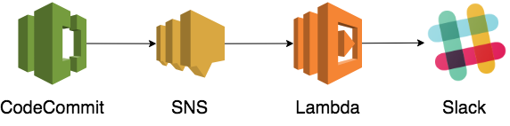

# Goal

This directory contains a CloudFormation template for CodeCommit notifier:
Once a user pushes a commit to a CodeCommit repository, the commit message is
sent to a Slack channel.

All the AWS resource will have the same name as stack name.

## Usage

This project provides a Makefile and CloudFormation template.
